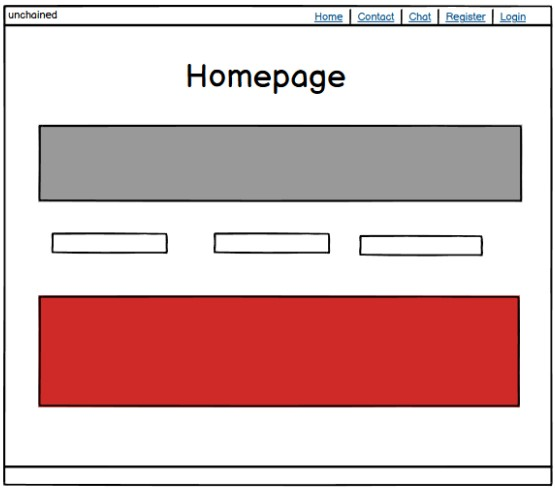
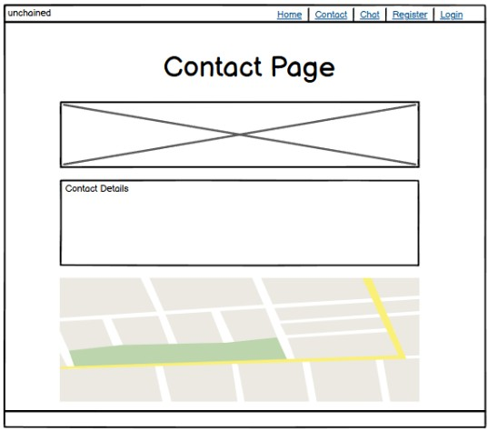
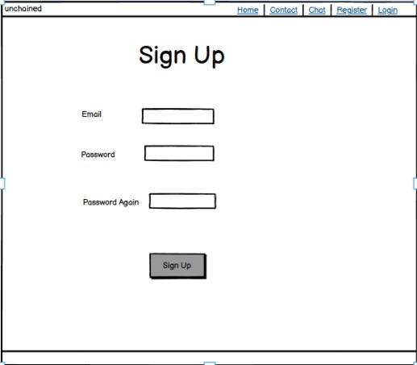
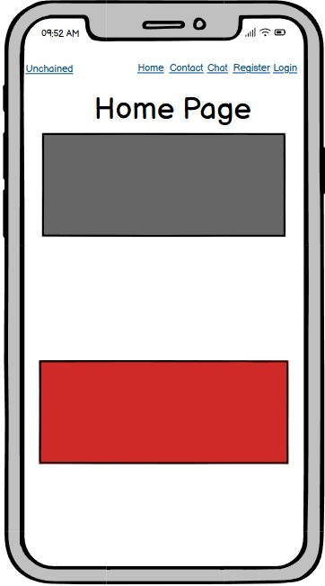
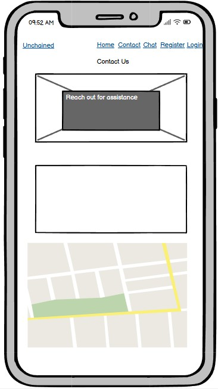
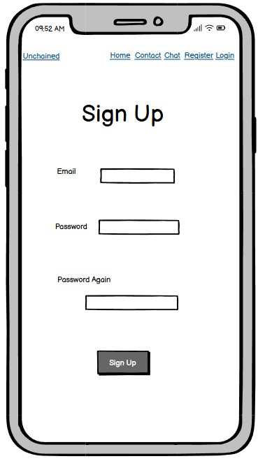
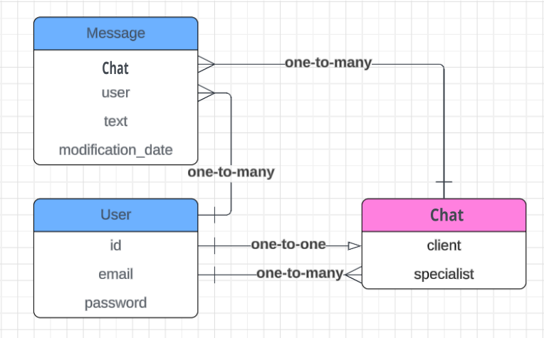

# UNCHAINED - A Django-Based Chat & Support System  

## Introduction  
UNCHAINED is a secure and private chat platform built with Django and Django Channels. It is designed to provide real-time communication between users and specialists, particularly for support services related to human trafficking prevention.  

**Live Site:** [UNCHAINED](https://unchained-2025-052483a9c06d.herokuapp.com/)

## Admin Access  
Admin users can log in via:  
**URL:** [Admin Panel](https://unchained-2025-052483a9c06d.herokuapp.com/admin)


## Table of Contents  
- [Introduction](#introduction)  
- [Admin Access](#admin-access)  
- [UX - User Experience](#ux---user-experience)  
- [Project Planning](#project-planning)  
- [Database Schema](#database-schema)  
- [Security](#security)  
- [Features](#features)  
- [User Views and Features](#user-views-and-features)  
- [CRUD Functionality](#crud-functionality)  
- [Future Features](#future-features)  
- [Technologies & Languages Used](#technologies--languages-used)  
- [Libraries, Frameworks & APIs](#libraries-frameworks--apis)  
- [Testing](#testing)  
- [Deployment](#deployment)  
- [Bugs](#bugs)  
- [Credits](#credits)  
- [Acknowledgements](#acknowledgements)  

## UX - User Experience  

### Target Audience  
- Individuals seeking secure, private support.  
- Specialists providing professional guidance.  

### User Goals  
- Secure, anonymous chat with specialists.  
- Easy navigation and account management.  

### Design Choices  
- Minimalist UI for easy navigation.  
- Mobile-first approach for accessibility.  
- Clear CTAs to guide users.  

## Color Scheme  

UNCHAINED utilizes a purposeful color scheme to enhance user experience, readability, and accessibility while aligning with the serious nature of its mission. 
The chosen colors convey professionalism, urgency, and clarity:  

- **Dark Grey (#303030):** Used for the header and footer backgrounds, providing a strong, modern, and neutral foundation.  
- **Blue (#25A2B8):** Highlight color for interactive elements (buttons, links), representing trust and communication.  
- **Red (#FE5249):** Emphasizes warnings, alerts, and urgent messages, symbolizing urgency and danger.  
- **Yellow (#EADE18):** Used for highlighting key information, evoking attention and awareness.  

These colors are consistently applied across the UI to create a cohesive and user-friendly experience.

## Project Planning  

### Agile Methodology  
- Managed via GitHub Issues and Kanban boards.  
- Iterative updates based on user feedback.  

### Wireframes  

#### Home Page  


#### Contact Page  


#### Signup Page  


#### Mobile Home Page  


#### Mobile Contact Page  


#### Mobile Signup Page  


Created using **Figma**.


## Database Schema  




- **Users** (Django Auth User model extended with profile data).  
- **ChatRooms** (Manages user-specialist chat sessions).  
- **Messages** (Stores chat history with timestamps).  
- **Reports** (Allows users to report suspicious activity).  


## Security  
- **Authentication:** Django Allauth for login and registration.  
- **Data Protection:** Encrypted database fields for sensitive user data.  
- **CSRF & XSS Protection:** Implemented via Django’s built-in security.  
- **HTTPS Only:** Enforced in production for secure transmission.  

## Features  
- **User Authentication** (Login, Registration, Logout)  
- **Real-Time Chat** with Django Channels & WebSockets  
- **Private Chat Rooms** (1:1 support)  
- **Specialist Assignment** for user chats  
- **Custom 403, 404, 500 Error Pages**  
- **Secure Messaging & User Privacy**  
- **Admin Dashboard** for managing users & reports  
- **Deployed on Heroku**  

## User Views and Features  

### Non-Members  
- View landing page and information.  
- Access limited resources.  

### Registered Users  
- Create and manage chat sessions.  
- View past messages.  
- Report incidents to admin.  

### Specialists  
- Join multiple chat rooms.  
- Respond to messages in real-time.  

### Admins  
- Manage users, specialists, and reports.  
- Monitor chat room activity.  

## CRUD Functionality  

| Feature | Create | Read | Update | Delete |  
|---------|--------|------|--------|--------|  
| User Profiles | ✅ | ✅ | ✅ | ✅ |  
| Chat Rooms | ✅ | ✅ | ✅ | ✅ |  
| Messages | ✅ | ✅ | ❌ | ❌ |  
| Reports | ✅ | ✅ | ✅ | ✅ |  

## Future Features  
- **AI Chatbot Support** for automated responses.  
- **File Sharing** within chat rooms.  
- **Multilingual Support** for accessibility.  

## Technologies & Languages Used  
- **Languages:** Python, JavaScript, HTML, CSS  
- **Frameworks:** Django, Django Channels, Bootstrap  
- **Database:** SQLite (Development), PostgreSQL (Production)  
- **Version Control:** Git & GitHub  
- **Hosting:** Heroku  
- **APIs:** Stripe (for payments), Google Maps (for location services)  

## Libraries, Frameworks & APIs  

| Name | Purpose |  
|------|---------|  
| Django | Backend framework |  
| Django Channels | WebSockets for real-time chat |  
| Bootstrap | Frontend styling |  
| Django Allauth | Authentication management |  
| Stripe | Payment processing |  
| Psycopg2 | PostgreSQL integration |  
| Whitenoise | Static file handling |  

## Testing  

### Code Validation  
- **Python:** Checked with PEP8.  
- **JavaScript:** Linted for syntax errors.  
- **HTML/CSS:** Validated using W3C validators.  

### Manual Testing  

| Feature | Expected Outcome | Result |  
|---------|-----------------|--------|  
| User Registration | User can sign up successfully | ✅ |  
| Login | User can log in with correct credentials | ✅ |  
| Chat Functionality | Messages are sent and received in real-time | ✅ |  
| Admin Panel | Admins can manage users and reports | ✅ |  

## Deployment  

### Local Setup  

1. Clone the repository:  
   ```sh
   git clone https://github.com/BogdanovaIV/unchained.git  
   cd unchained  
   ```  
2. Create a virtual environment:  
   ```sh
   python3 -m venv env  
   source env/bin/activate  
   ```  
3. Install dependencies:  
   ```sh
   pip install -r requirements.txt  
   ```  
4. Apply migrations:  
   ```sh
   python manage.py migrate  
   ```  
5. Run the server:  
   ```sh
   python manage.py runserver  
   ```  
6. Access the site at `http://127.0.0.1:8000/`  

### Heroku Deployment  

1. Login to Heroku:  
   ```sh
   heroku login  
   ```  
2. Create an app:  
   ```sh
   heroku create unchained-app  
   ```  
3. Push to Heroku:  
   ```sh
   git push heroku main  
   ```  
4. Apply migrations:  
   ```sh
   heroku run python manage.py migrate  
   ```  
5. Open the app:  
   ```sh
   heroku open  
   ```  

### Environment Variables  

Ensure the following environment variables are set:  

```
SECRET_KEY=your-secret-key  
DEBUG=False  
ALLOWED_HOSTS=your-domain.com,localhost,127.0.0.1  
DATABASE_URL=your-database-url  
GOOGLE_MAPS_API_KEY=your-google-maps-key  
```  

## Bugs  

### Known Issues  
- WebSockets may disconnect intermittently on slow networks.  
- Some mobile browsers have inconsistent styling for chat messages.  

### Resolved Issues  
- Fixed login redirection bug.  
- Adjusted specialist chat room access permissions.  

## Credits  

### Code Inspiration  
- Django Documentation  
- Stack Overflow  
- Django Channels Tutorials  

### Media  
- Icons and assets from Font Awesome.  
- Images sourced from Unsplash and Pexels.  

## Acknowledgements  
- Thanks to all contributors for their valuable feedback.  
- Special appreciation to the Code Institute community for guidance.  
